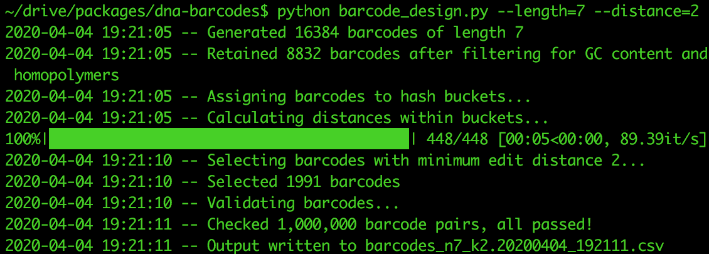

# dna-barcodes

Generate DNA barcode sets with guaranteed minimum edit distance between any two barcodes. 
Levenshtein string distance is used, so error-correction and detection are applicable when the barcode is embedded in a known sequence, such as a barcoded primer or vector.
Similar to [DNABarcodes](https://www.bioconductor.org/packages/release/bioc/html/DNABarcodes.html), but may yield larger barcode sets in less time. 

## Install
Requires python 3.6 or higher. The example below uses conda, available [here](https://docs.conda.io/en/latest/miniconda.html).

```
conda create -n dnabarcodes python=3.6
conda activate dnabarcodes
conda install -y --file requirements.txt
```
## Run

```
python barcode_design.py -h
python barcode_design.py
```



